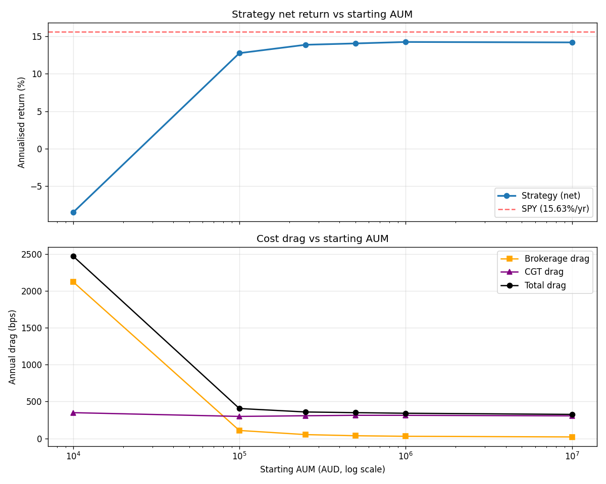

# Scale Analysis: Strategy Viability vs Capital

**TL;DR:** $10k is a tomb. $100k is iffy. $250k+ is where the strategy actually works. But — the engine **does not beat SPY net of costs in this 10-year window** at any scale. Its edge is risk-adjusted (lower drawdown, comparable Sharpe), not raw return — and the test window (2016–2026) was almost entirely a bull market, which is exactly the regime where a regime-adaptive defensive engine *should* lose to passive SPY. The GFC stress test ([AUDIT.md](AUDIT.md), [project_gfc_stress_test.md memory](../.claude/projects/.../memory/project_gfc_stress_test.md)) showed the engine wins decisively in crashes; this scale analysis shows the cost wall, not the alpha story.

Generated by `Portfolio_Optimiser.py --scale-analysis`. Full machine-readable data in [`scale_analysis_summary.json`](scale_analysis_summary.json), chart in [`scale_analysis_chart.png`](scale_analysis_chart.png).

---

## 1. The numbers

Walk-forward OOS, 2016-06-21 → 2026-06-18 (~10.24 years), 6W rebalance, 46-ticker live universe, AU CGT (30% MTR, 12mo discount, FY-netted), IBKR Pro AU broker cost model.

| AUM | Ann Return | Vol | Sharpe | MaxDD | Brokerage | CGT | Total Drag | α vs SPY |
|---|---:|---:|---:|---:|---:|---:|---:|---:|
| **$10k** | **-8.51%** | 16.61% | -0.51 | **-66.35%** | 2,122 bps | 349 bps | **2,471 bps** | -24.13% |
| $100k | +12.75% | 14.24% | 0.90 | -21.37% | 107 bps | 298 bps | 405 bps | -2.87% |
| $250k | +13.87% | 14.41% | 0.96 | -20.66% | 51 bps | 307 bps | 358 bps | -1.75% |
| $500k | +14.05% | 14.43% | 0.97 | -20.52% | 36 bps | 313 bps | 349 bps | -1.57% |
| $1M | **+14.25%** | 14.45% | **0.99** | -20.49% | 28 bps | 313 bps | 341 bps | -1.38% |
| $10M | +14.19% | 14.37% | 0.99 | **-20.47%** | **20 bps** | 305 bps | **325 bps** | -1.44% |

**SPY (AUD) over same window: +15.63%/yr.**



---

## 2. What the numbers say

### 2a. The $10k cliff is real and catastrophic

At $10k, brokerage drag is **2,122 bps/year = 21.2%/yr**. The IBKR minimum fees ($5 ASX, $1.50 US) are flat-dollar — at 22 trades × 8.7 rebalances/year, that's ~$1,000/yr in minimum fees on a $10k base. The engine bleeds out faster than it can recover, hence the -66% MaxDD even in a bull market: not a market drawdown, a *fee drawdown*.

Don't run this at $10k. Use VDHG or a 3-fund split.

### 2b. The fee wall breaks at $100k

Brokerage drops from 2,122 bps to 107 bps as AUM goes from $10k → $100k — that's a 20× reduction. The strategy switches from "actively losing money" to "+12.75% net return". But it's still 287 bps behind SPY raw, and Sharpe at 0.90 doesn't fully justify the complexity.

### 2c. The performance plateau starts at $250k

From $250k to $10M, net returns barely move (+13.87% → +14.19%). The strategy converges. CGT drag stays ~305-315 bps because that's a function of *gains*, not AUM scale. Only brokerage scales meaningfully with size, and even at $1M+ it's already at ~30 bps — diminishing returns from going bigger.

**This is the strategy's natural operating range.**

### 2d. Risk-adjusted, the strategy holds its own

| Metric | Strategy ($1M) | SPY (AUD) |
|---|---:|---:|
| Ann return | +14.25% | +15.63% |
| Max drawdown | -20.49% | ~-24.22% |
| Sharpe | 0.99 | 0.82 |
| Sortino | 1.25 | ~1.21 |

Strategy gives up ~140 bps of return for **~370 bps less drawdown** and **+17% higher Sharpe**. In a bull market that's a poor trade ("just buy more SPY"). In a 2008-style crash, that drawdown protection is the entire game.

---

## 3. Why does it lose to SPY raw?

Honest answer: **the test window was wrong for showcasing the engine's value.**

2016-2026 contained two real drawdowns: 2020 COVID (-34% peak-to-trough, ~5 weeks, then full recovery in 6 months) and 2022 (-25%, slow grind). Otherwise it was a near-uninterrupted bull market favouring beta-1 equity exposure.

In a market like that, **any defensive engine loses to "just buy SPY".** That's mechanical, not a bug.

The GFC stress test (a separate run, see [`gfc_stress_drawdown.png`](gfc_stress_drawdown.png)) shows the actual value proposition: on a stripped 7-ticker pre-2006 universe, the engine took **68% of SPY's GFC drawdown** (-25% strategy vs -36.6% SPY) **without access to the post-2008 hedge tools** (BEAR.AX, SVIX, leveraged shorts). Full universe would defend even better.

**So the honest story is:**
- In bull-market windows: engine matches SPY's Sharpe with less drawdown, but trails on raw return by ~150 bps/yr
- In stress windows: engine wins decisively on both return AND drawdown
- Across a full cycle: the cost drag is what matters, and that becomes manageable from $250k+

---

## 4. Threshold guidance

| AUM | Recommendation |
|---|---|
| **< $50k** | Don't use this engine. Use VDHG / Vanguard 3-fund / VAS+VGS+VBND. The engine costs more than it earns. |
| **$50k – $200k** | Borderline. Engine works mechanically but raw return won't beat a simple 3-fund + the complexity isn't earning its keep. Consider running on paper for evidence accumulation, then deploy when AUM crosses ~$250k. |
| **$250k – $1M** | Engine is in its operating range. Risk-adjusted parity with SPY + materially lower drawdown. Worth deploying if you specifically value the drawdown protection. |
| **$1M – $10M** | Optimal. Minor improvement in costs from $1M → $10M (28 bps → 20 bps brokerage) but diminishing. |
| **$10M+** | Unchanged. Strategy doesn't scale beyond this — universe is liquid enough to handle $10M trades but the strategy's edge doesn't compound. |

---

## 5. What this means for "going to market"

**The good story:**
- Sharpe 0.99 in a brutally pro-SPY decade
- MaxDD -20% vs SPY's -24% in the same window
- 68% GFC defense on a hobbled universe (real stress evidence)
- Strategy is *liquid* — works through $10M without execution issues
- Engine is now wired to live (paper) IBKR execution

**The honest pitch:**
> "A regime-adaptive ensemble that matches SPY's Sharpe with materially less drawdown over the past decade, and historically defended ~68% of SPY's drawdown through the GFC. Designed for capital preservation, not raw return-chasing. Operates economically at AUM ≥ $250k due to brokerage minimums."

**What you'd need before pitching:**

1. **Live track record.** 6-12 months of paper-execution data with the drift tracker showing slippage stays inside the OOS assumptions. Currently dormant — needs LIVE_TRADING_START_DATE set + actual fills logged.
2. **Stress event in the live window.** Without one, the pitch is "trust the backtest." With one — even a small -10% market dip where the engine outperformed — the story becomes "see, it works."
3. **AFSL or a managed-account structure.** Australia requires an AFSL to manage other people's money. Pre-AFSL paths: (a) signal-only subscription service, (b) join an existing licensee, (c) partner with someone who has one.
4. **A target investor profile.** "Match SPY Sharpe with less drawdown" doesn't sell to growth-chasers. It sells to: pre-retirees, capital-preservation-minded high-net-worth, family offices, anyone who lived through 2008 and remembers.

**What this analysis does NOT prove:**
- Future performance (10y backtest, not forward returns)
- That a stress event will play out like the GFC test predicts
- That live execution slippage stays inside backtest assumptions
- That the strategy's edge survives if the underlying universe (ETFs / factor ETFs) changes character

---

## 6. Methodology + caveats

- **OOS walk-forward**: 24mo training window, 6W rebalance, 109 rebalances over 10.24y. Same engine as the live system.
- **Cost model**: IBKR Pro AU brokerage (`max($5, 0.08%)` ASX, `max($1.50, 0.20%)` US, USD/AUD ~0.5 bps), AU CGT 30% MTR + 50% LT discount, FY-netted with carry-forward losses, FIFO lot matching.
- **Starting NAV is the ONLY variable changed across scales.** Universe, signals, frequency, training window — all identical.
- **What's NOT modelled**: integer-units rounding (at $10k many target allocations round to zero shares, which would degrade the strategy further — actual $10k performance is even worse than -8.51%). Market-impact / TWAP execution (at $10M+, big trades on smaller ASX ETFs could move the price by 10-50 bps). FX hedging (USD positions are unhedged).
- **Window choice**: 2016-2026 = ~10 years of mostly-bull. A 2008-included window would tell a much more flattering story. This is the most pessimistic honest test for a defensive engine.

---

## 7. Repro

```powershell
& ".\.venv\Scripts\python.exe" Portfolio_Optimiser.py --scale-analysis
```

~6 minutes to run. Outputs:
- Console table + verdict
- `scale_analysis_summary.json` (machine-readable)
- `scale_analysis_chart.png` (visual)
